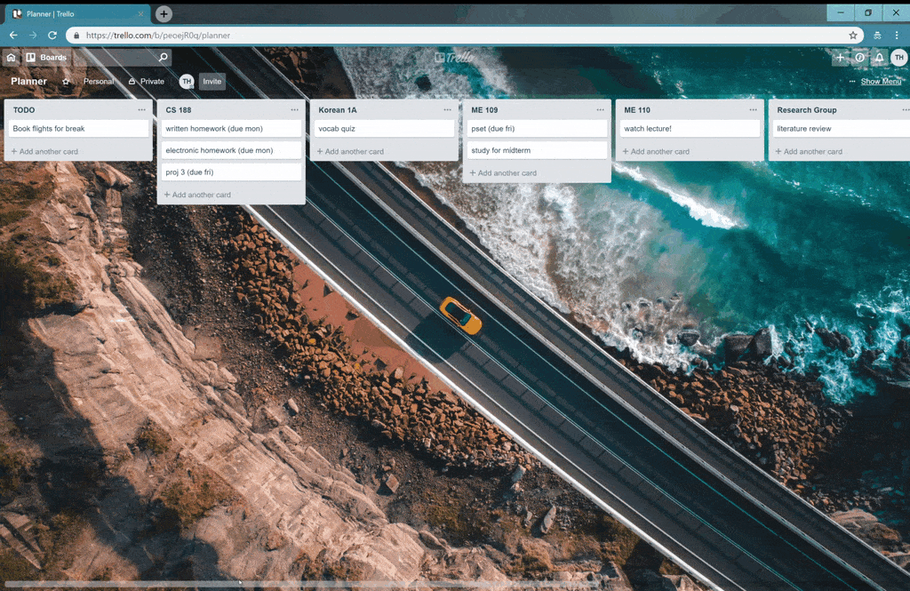
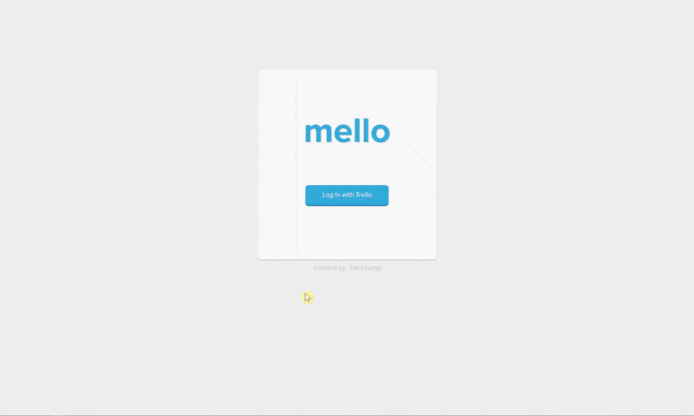
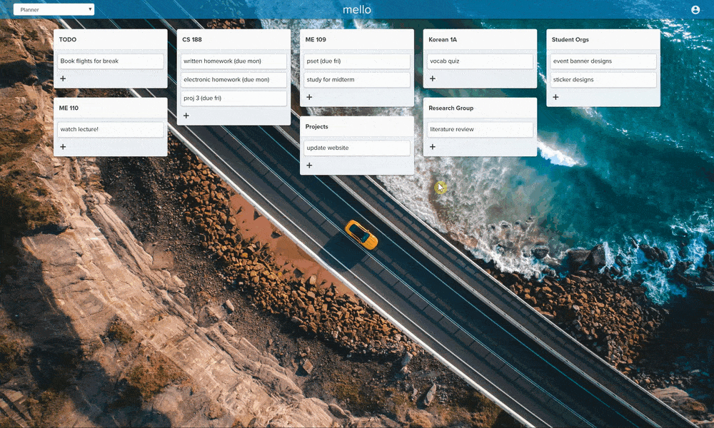
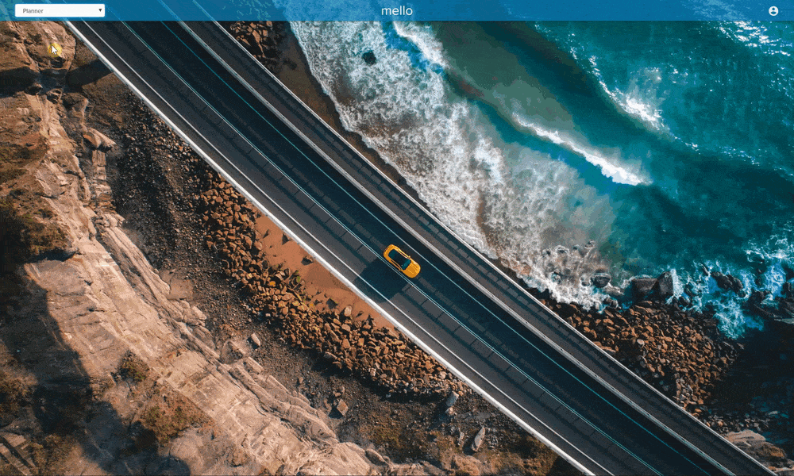
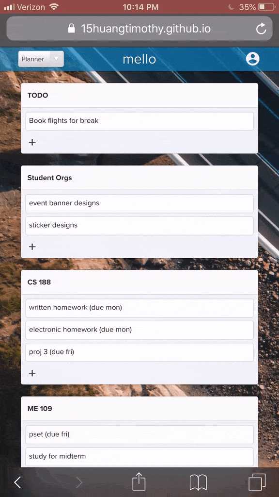

# mello 

A Trello-based UI geared towards personal to-do lists instead of team project management.

Site at: https://15huangtimothy.github.io/mello

## Motivation

Trello is widely used project management tool providing collaborative kanban style boards to teams. However, I enjoy using Trello as my own personal planner/to-do list rather than for project management. I have a set of Trello lists to help categorize my tasks, but these lists end up going off the page, as Trello only supports side-by-side tasklists stacked horizontally, rather than vertically. This prevents me from seeing all my tasks in one glance and forces me to horizontally scroll across the page to make sure I don't miss anything. Furthermore, Trello provides a lot of features that aren't necessary for a simple personal to-do list, producing a busy and unnecessary interface for my purposes.

  

I've been wanting to gain more experience with React and this offered a great opportunity for my first React project. I wanted to make a web app that would link with my Trello account and display my data in a format more geared towards personal to-do lists, particularly focusing on both horizontal and vertical stacking of tasklists to allow for a birds-eye view of all current tasks at a quick glance without the need for any awkward horizontal scrolling.

## Features

### Automatic tasklist grid generation

* Compiles all Trello tasks and tasklists into an intuitive drag-and-drop grid layout without horizontal scrolling.

  

### Trello Account Integration

* Syncs data with existing Trello account through Trello's API, including creating new tasks, checking off existing tasks, and loading each board's custom background image.

  

### Drag-and-drop functionality

* Mobile/touch compatible drag-and-drop functionality for both tasklists and individual tasks.

  

### Mobile-responsive

* Designed to be usable on both desktop and mobile

  

## Built With

* [React](https://reactjs.org/)
* [Bootstrap](https://getbootstrap.com/) 
* [react-beautiful-dnd](https://github.com/atlassian/react-beautiful-dnd)
* [Packery](https://packery.metafizzy.co/)
* [Trello API](https://developers.trello.com/)
